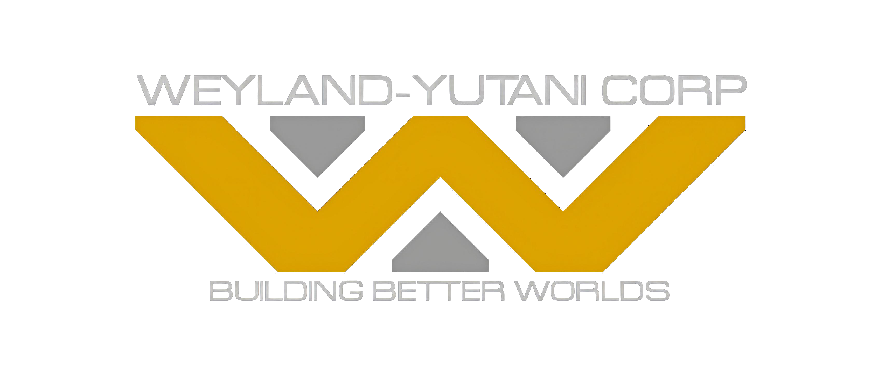
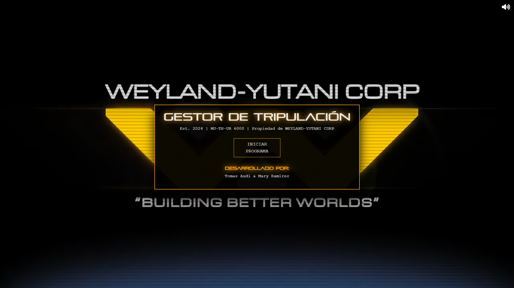
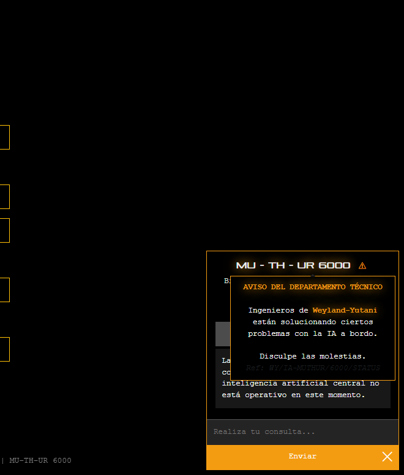
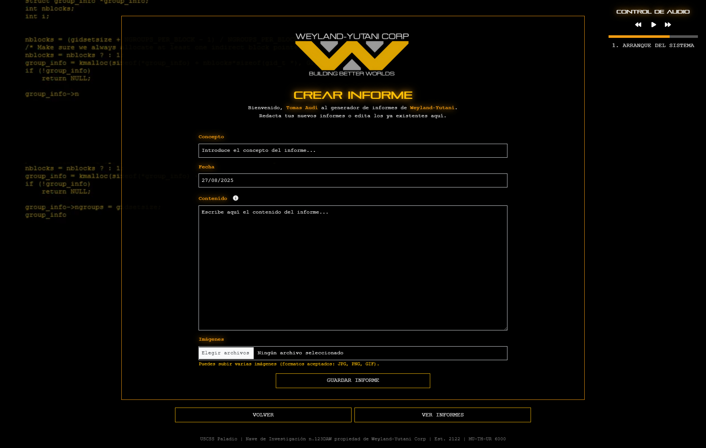

<!--<head>
  <link href="https://fonts.googleapis.com/css2?family=Courier+New&display=swap" rel="stylesheet">
  
</head>
-->

# USCSS Paladio

## 1. INTRODUCCIÓN

### Descripción del Proyecto
Este proyecto es un sistema de gestión de informes diseñado para la tripulación de la nave **USCSS Paladio**, propiedad de **Weyland-Yutani**, como una extensión de la inteligencia artificial del ordenador de abordo **MU_TH_UR 6000**. En este sistema, los tripulantes pueden registrarse, asignarse su rol correspondiente y completar su perfil con una biografía y una foto.

Una vez registrados, cada usuario puede redactar y almacenar informes en su lista personal. Los roles de **Capitán** y **Primer Oficial** cuentan con privilegios especiales, que les permiten visualizar los informes de toda la tripulación.

El sistema también incluye una herramienta de mensajería interna, facilitando la comunicación directa entre tripulantes mediante el envío y respuesta de mensajes.

Por último, ofrece opciones de personalización de la interfaz, permitiendo a los usuarios modificar el fondo de pantalla eligiendo entre varios diseños de código visual.

### Contexto
Este proyecto está inspirado en el universo de **Alien: El octavo pasajero**, película de ciencia ficción de los años 70. En lugar de la famosa nave **Nostromo**, nos centramos en la nave **USCSS Paladio**, una creación de **Weyland-Yutani**.

La interfaz del sistema de gestión de informes está diseñada con un estilo retro-futurista que recuerda a la estética de los años 70. La idea es crear una experiencia que evoca una sensación de claustrofobia y frialdad, mientras los tripulantes gestionan sus informes y se comunican entre ellos.

El proyecto incluye un salvapantallas inicial, seguido de una pantalla de inicio de sesión para autenticar a los usuarios. Una vez dentro, se accede a un menú principal que ofrece múltiples funcionalidades, organizadas de manera intuitiva para facilitar la navegación y el acceso a las diferentes herramientas.

- **Salvapantallas inicial**

- **Inicio de sesión y nuevo registro de tripulante**

- **Menú principal y multiples funcionalidades**

- **Menú principal y chat con la IA abordo**
  Esta funcionalidad sige estando en desarrollo.

## 2. METODOLOGÍA

### Diseño
Todo el diseño parte de una idea general que, poco a poco, ha ido tomando forma y expandiéndose, a medida que se han ido incorporando nuevas funcionalidades. El diseño está directamente inspirado en el logo de la empresa y utiliza el negro y el amarillo como colores principales, creando una estética llamativa y futurista. Además, se han elegido dos tipografías completamente diferentes: Pirulen, una fuente sumamente futurista que solo acepta mayúsculas y se utiliza para los títulos, y Courier, una tipografía estilo máquina de escribir que se emplea para el cuerpo del texto. El contraste entre ambas tipografías refuerza la sensación de una mezcla entre lo retro y lo futurista, evocando la atmósfera clásica de las películas de ciencia ficción.

### Desarrollo
El trabajo en este proyecto se ha dividido de manera clara y eficiente entre los dos desarrolladores, cada uno encargado de una parte específica del desarrollo: Tomas se ha encargado del front-end, mientras que Mary se ha centrado en el back-end. Esta división ha permitido que cada uno se especializara en su área, asegurando que ambas partes del proyecto fueran optimizadas y se desarrollaran de manera independiente.

Sin embargo, a lo largo del proceso, han existido áreas donde ambos desarrolladores han colaborado más allá de sus roles tradicionales. En ciertos puntos, Tomas, encargado del front-end, ha intervenido en tareas del back-end, desarrollando funcionalidades que requieren interacción con el servidor, como la gestión de la base de datos o la implementación de la lógica del servidor. Por su parte, Mary, a pesar de ser la responsable del back-end, también ha trabajado en algunos aspectos del front-end, particularmente en la integración de la interfaz de usuario con los datos dinámicos gestionados en el servidor, asegurando que la experiencia del usuario fuera fluida y coherente.

Este enfoque de trabajo colaborativo ha permitido un desarrollo más ágil y ha favorecido la flexibilidad en el proyecto, ya que ambos desarrolladores han podido contribuir a la vez en diferentes capas del sistema, asegurando que tanto la parte visual como la funcionalidad del sitio estén bien integradas.

## 3. Tecnologías Utilizadas
Para realizar este proyecto se han utilizado HTML, CSS, PHP y JavaScript, cada uno con un propósito específico:

- **HTML (HyperText Markup Language):** Es el lenguaje principal para la estructura de la página web. Con HTML se crean las distintas secciones del proyecto, como formularios de registro, informes y la interfaz de usuario. Define la estructura básica de las páginas y organiza el contenido.
 
- **CSS (Cascading Style Sheets):** Este lenguaje se utiliza para dar estilo y diseño a la página web. Con CSS se controla la apariencia visual del sitio, como los colores, las fuentes, la disposición de los elementos en la pantalla y la personalización de la interfaz, asegurando que el diseño sea atractivo y funcional.
 
- **PHP (Hypertext Preprocessor):** PHP se usa en el backend del proyecto para gestionar la lógica del servidor. Permite manejar el registro y autenticación de los usuarios, almacenar y recuperar los informes, y generar contenido dinámico según las acciones de los usuarios, como mostrar los informes de la tripulación o enviar mensajes.
 
- **JavaScript:** Se utiliza principalmente para agregar interactividad al sitio web. JavaScript permite que la página responda de manera dinámica a las acciones del usuario, como la actualización de la interfaz sin tener que recargar la página, la validación de formularios en tiempo real y la gestión de la personalización de la interfaz, como el cambio de fondos.

### Frameworks y Librerías
Para este proyecto hemos utilizado Bootstrap debido a su facilidad para crear interfaces ordenadas y funcionales rápidamente. Este framework ofrece una gran variedad de componentes pre-diseñados, como botones, formularios y barras de navegación, lo que facilita mucho la implementación de la interfaz sin tener que diseñarlo todo desde cero.

Además, Bootstrap utiliza un sistema de rejillas que permite crear diseños responsivos, lo que asegura que la página se vea bien en cualquier dispositivo, ya sea en una computadora o un móvil. Su documentación clara y su gran comunidad también han hecho que el desarrollo sea más ágil y sencillo.

En resumen, Bootstrap ha sido una herramienta clave para crear una interfaz atractiva, fácil de usar y accesible en todos los dispositivos.

## 4. Características Principales  

### Funcionalidades:  
El sistema desarrollado para la gestión de informes de la tripulación de la nave **USCSS Paladio** incluye varias funcionalidades clave, que proporcionan una experiencia interactiva y eficiente para los usuarios. Las principales características son las siguientes:  

- **Sistema de Inicio de Sesión y Registro de Usuarios**  
  Incluye un sistema de autenticación que garantiza que solo los tripulantes registrados puedan acceder a sus perfiles, realizar informes y consultar mensajes. Los tripulantes pueden iniciar sesión con sus credenciales para acceder a sus funciones personalizadas.

  ###### Ventana de inicio
  En esta pantalla inicial nos permite iniciar sesión, crear un nuevo usuario o cerrar el porgrama.
  
  ###### Iniciar sesión
  
  ###### Nuevo registro
  

---

- **Gestión de Informes de Tripulantes**  
  El sistema permite gestionar y almacenar los informes de los tripulantes de la nave. Cada tripulante puede registrarse proporcionando su nombre, rol dentro de la nave, biografía y una foto de perfil. Esta información facilita el control de los miembros de la tripulación y el acceso a sus informes.
  ###### Menú principal del gestor de informes 
  
  ###### Redactar nuevo informe
  
  ###### Gestor de informes del tripulante
  Listado de informes del usuario.
  
  
  ###### Visualización de informes
  
  ###### Edición de informes
  Permite la edición del contenido del informe.
  
  ###### Administrador de informes
  Si posees el rol adecuado puedes visualizar todos los informes almacenados en la base de datos.
  

---

- **Servicio de Mensajería Interno**  
  Permite a los usuarios registrados interactuar entre sí mediante un sistema de mensajería. Los mensajes enviados pueden ser respondidos directamente, fomentando una comunicación sencilla y efectiva entre los miembros.

  ###### Envío de mensajes
  

  ###### Buzón de entrada
  
  

---

- **Personalización del perfil**
  ###### Perfil
  
  ###### Editar perfil
  
  ###### Opciones de HUD
  Ofrece la posibilidad de personalizar el fondo de la interfaz de usuario, permitiendo a los tripulantes elegir entre cinco modelos diferentes de codificación, adaptando la apariencia según sus preferencias.  
  
---

- **Control de Música Interactivo**  
  Una funcionalidad adicional del sistema es el control de música, que proporciona una reproducción de música ininterrumpida. Los usuarios pueden controlar las canciones mediante botones de reproducción/pausa, retroceso y avance. También incorpora una linea de tiempo de la pista en reproducción. Esta herramienta está integrada en la interfaz en la parte superior derecha del HUD.
    

---

## 5. Estado Actual
### Logros

- Un sistema de registro y autenticación de usuarios.
- La funcionalidad de creación y edición de informes.
- Un sistema de mensajería interno para la comunicación entre usuarios.
- Un editor de interfaz (HUD) para personalizar la apariencia de la aplicación.
- Un reproductor de música y una sección de buzón de entrada.
- Experiencia UI / UX notablemente mejorada, detalles pulidos.
- Organización del codigo.
- Organización del proyecto en si.

### Próximos Pasos
- Implementar el funcionamiento del chat con la IA.
- Implementar la funcionalidad registro de movimientos.
- Implementar el editor de texto mejorado para la redacción de informes.
- 
#### Autores 
**Tomàs Audi**
[@taudigilabert (GitHub)](https://github.com/taudigilabert)
[@Tomas Audi (LinkedIn)](https://linkedin.com/in/tomas-audi-gilabert-10a47019b)

**Mary Ramirez**

*Video demostración en YouTube:*

