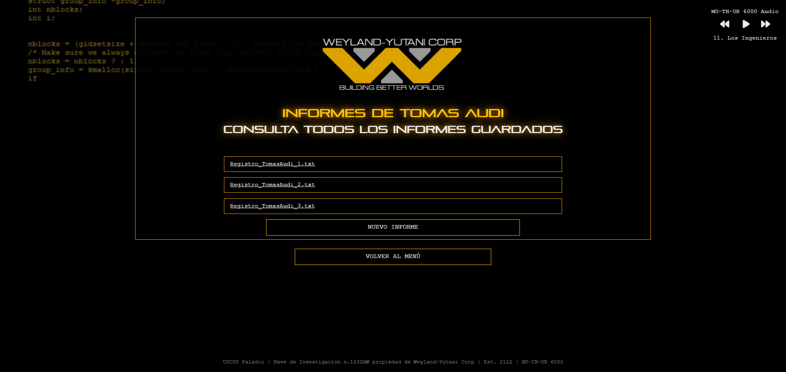

<!--<head>
  <link href="https://fonts.googleapis.com/css2?family=Courier+New&display=swap" rel="stylesheet">
  <style>
    body {
      font-family: "Courier New", sans-serif;
      background-color: black;
      color: white;
      padding: 20px;
      border: 4px solid #f39c12;
    }
  </style>
</head>
-->


# USCSS Paladio

## 1. INTRODUCCIÓN

### Descripción del Proyecto
Este proyecto es un sistema de gestión de informes diseñado para la tripulación de la nave **USCSS Paladio**, propiedad de **Weyland-Yutani**, como una extensión de la inteligencia artificial del ordenador de abordo **MU_TH_UR 6000**. En este sistema, los tripulantes pueden registrarse, asignarse su rol correspondiente y completar su perfil con una biografía y una foto.

Una vez registrados, cada usuario puede redactar y almacenar informes en su lista personal. Los roles de **Capitán** y **Primer Oficial** cuentan con privilegios especiales, que les permiten visualizar los informes de toda la tripulación.

El sistema también incluye una herramienta de mensajería interna, facilitando la comunicación directa entre tripulantes mediante el envío y respuesta de mensajes.

Por último, ofrece opciones de personalización de la interfaz, permitiendo a los usuarios modificar el fondo de pantalla eligiendo entre varios diseños de código visual.


### Contexto
Este proyecto está inspirado en el universo de **Alien: El octavo pasajero**, película de ciencia ficción de los años 70. En lugar de la famosa nave **Nostromo**, nos centramos en la nave **USCSS Paladio**, una creación de **Weyland-Yutani**.

La interfaz del sistema de gestión de informes está diseñada con un estilo retro-futurista que recuerda a la estética de los años 70. La idea es crear una experiencia que evoca una sensación de claustrofobia y frialdad, mientras los tripulantes gestionan sus informes y se comunican entre ellos.

El proyecto incluye un salvapantallas inicial, seguido de una pantalla de inicio de sesión para autenticar a los usuarios. Una vez dentro, se accede a un menú principal que ofrece múltiples funcionalidades, organizadas de manera intuitiva para facilitar la navegación y el acceso a las diferentes herramientas.

- **Salvapantallas inicial**


- **Inicio de sesión y nuevo registro de tripulante**


- **Menú principal y multiples funcionalidades**


## 2. METODOLOGÍA

### Diseño
Todo el diseño parte de una idea general que, poco a poco, ha ido tomando forma y expandiéndose, a medida que se han ido incorporando nuevas funcionalidades. El diseño está directamente inspirado en el logo de la empresa y utiliza el negro y el amarillo como colores principales, creando una estética llamativa y futurista. Además, se han elegido dos tipografías completamente diferentes: Pirulen, una fuente sumamente futurista que solo acepta mayúsculas y se utiliza para los títulos, y Courier, una tipografía estilo máquina de escribir que se emplea para el cuerpo del texto. El contraste entre ambas tipografías refuerza la sensación de una mezcla entre lo retro y lo futurista, evocando la atmósfera clásica de las películas de ciencia ficción.

### Desarrollo
El trabajo en este proyecto se ha dividido de manera clara y eficiente entre los dos desarrolladores, cada uno encargado de una parte específica del desarrollo: Tomas se ha encargado del front-end, mientras que Mary se ha centrado en el back-end. Esta división ha permitido que cada uno se especializara en su área, asegurando que ambas partes del proyecto fueran optimizadas y se desarrollaran de manera independiente.

Sin embargo, a lo largo del proceso, han existido áreas donde ambos desarrolladores han colaborado más allá de sus roles tradicionales. En ciertos puntos, Tomas, encargado del front-end, ha intervenido en tareas del back-end, desarrollando funcionalidades que requieren interacción con el servidor, como la gestión de la base de datos o la implementación de la lógica del servidor. Por su parte, Mary, a pesar de ser la responsable del back-end, también ha trabajado en algunos aspectos del front-end, particularmente en la integración de la interfaz de usuario con los datos dinámicos gestionados en el servidor, asegurando que la experiencia del usuario fuera fluida y coherente.

Este enfoque de trabajo colaborativo ha permitido un desarrollo más ágil y ha favorecido la flexibilidad en el proyecto, ya que ambos desarrolladores han podido contribuir a la vez en diferentes capas del sistema, asegurando que tanto la parte visual como la funcionalidad del sitio estén bien integradas.


## 3. Tecnologías Utilizadas
Para realizar este proyecto se han utilizado HTML, CSS, PHP y JavaScript, cada uno con un propósito específico:

- **HTML (HyperText Markup Language):** Es el lenguaje principal para la estructura de la página web. Con HTML se crean las distintas secciones del proyecto, como formularios de registro, informes y la interfaz de usuario. Define la estructura básica de las páginas y organiza el contenido.
<br>
- **CSS (Cascading Style Sheets):** Este lenguaje se utiliza para dar estilo y diseño a la página web. Con CSS se controla la apariencia visual del sitio, como los colores, las fuentes, la disposición de los elementos en la pantalla y la personalización de la interfaz, asegurando que el diseño sea atractivo y funcional.
<br>
- **PHP (Hypertext Preprocessor):** PHP se usa en el backend del proyecto para gestionar la lógica del servidor. Permite manejar el registro y autenticación de los usuarios, almacenar y recuperar los informes, y generar contenido dinámico según las acciones de los usuarios, como mostrar los informes de la tripulación o enviar mensajes.
<br>
- **JavaScript:** Se utiliza principalmente para agregar interactividad al sitio web. JavaScript permite que la página responda de manera dinámica a las acciones del usuario, como la actualización de la interfaz sin tener que recargar la página, la validación de formularios en tiempo real y la gestión de la personalización de la interfaz, como el cambio de fondos.


### Frameworks y Librerías
Para este proyecto hemos utilizado Bootstrap debido a su facilidad para crear interfaces ordenadas y funcionales rápidamente. Este framework ofrece una gran variedad de componentes pre-diseñados, como botones, formularios y barras de navegación, lo que facilita mucho la implementación de la interfaz sin tener que diseñarlo todo desde cero.

Además, Bootstrap utiliza un sistema de rejillas que permite crear diseños responsivos, lo que asegura que la página se vea bien en cualquier dispositivo, ya sea en una computadora o un móvil. Su documentación clara y su gran comunidad también han hecho que el desarrollo sea más ágil y sencillo.

En resumen, Bootstrap ha sido una herramienta clave para crear una interfaz atractiva, fácil de usar y accesible en todos los dispositivos.

## 4. Características Principales  

### Funcionalidades:  
El sistema desarrollado para la gestión de informes de la tripulación de la nave **USCSS Paladio** incluye varias funcionalidades clave, que proporcionan una experiencia interactiva y eficiente para los usuarios. Las principales características son las siguientes:  

- **Gestión de Informes de Tripulantes**  
  El sistema permite gestionar y almacenar los informes de los tripulantes de la nave. Cada tripulante puede registrarse proporcionando su nombre, rol dentro de la nave, biografía y una foto de perfil. Esta información facilita el control de los miembros de la tripulación y el acceso a sus informes.  
    

- **Sistema de Inicio de Sesión y Registro de Usuarios**  
  Incluye un sistema de autenticación que garantiza que solo los tripulantes registrados puedan acceder a sus perfiles, realizar informes y consultar mensajes. Los tripulantes pueden iniciar sesión con sus credenciales para acceder a sus funciones personalizadas.  
    

- **Control de Música Interactivo**  
  Una funcionalidad adicional del sistema es el control de música, que proporciona una reproducción de música ininterrumpida. Los usuarios pueden controlar las canciones mediante botones de reproducción/pausa, retroceso y avance. Esta herramienta está integrada en la interfaz en la parte superior derecha del HUD.  
    

- **Modales para Mejorar el Inicio de Sesión**  
  Se han implementado modales para ofrecer una experiencia de inicio de sesión más fluida. Estos modales permiten crear un nuevo registro de tripulantes o iniciar sesión sin necesidad de navegar a diferentes páginas, mejorando la interacción y la navegación dentro de la plataforma.  
    
    

- **Servicio de Mensajería Interno**  
  Permite a los usuarios registrados interactuar entre sí mediante un sistema de mensajería. Los mensajes enviados pueden ser respondidos directamente, fomentando una comunicación sencilla y efectiva entre los miembros.  
    
    

- **Personalización del HUD**  
  Ofrece la posibilidad de personalizar el fondo de la interfaz de usuario, permitiendo a los tripulantes elegir entre cinco modelos diferentes de codificación, adaptando la apariencia según sus preferencias.  
    


## 5. Avances y Estado Actual

### Progreso del Proyecto
El proyecto ha sido completamente implementado y está en pleno funcionamiento, habiendo alcanzado todos los objetivos establecidos en la fase inicial. A continuación, se detallan los logros alcanzados:

- Sistema de registro: Los usuarios pueden registrarse de manera sencilla y segura.
- Sistema de inicio de sesión: Los usuarios pueden acceder a sus cuentas de manera eficiente.
- Sistema de verificación de usuario: Se implementó una verificación para garantizar que solo los usuarios registrados puedan acceder a sus cuentas.
- Registro de informes nuevos: Los usuarios pueden crear y guardar informes personalizados.
- Editor de informes: El editor permite modificar los informes previamente creados.
- Sistema de mensajería: Los usuarios pueden enviar y recibir mensajes internos dentro de la plataforma.
- Editor de HUD: Los usuarios pueden personalizar el fondo de la aplicación según sus preferencias.
- Reproductor de música: Se integró un reproductor de música funcional que permite la reproducción de audios dentro de la aplicación.
- Sección de buzón de entrada: Cada usuario tiene acceso a su buzón de entrada para recibir mensajes de otros usuarios.

### Tareas Pendientes
A pesar de haber logrado implementar todos los objetivos principales, algunas tareas adicionales se dejaron pendientes. Una vez completados los objetivos clave, decidimos implementar la funcionalidad de editar perfil, que permite a los usuarios modificar su biografía y su imagen de perfil. Sin embargo, no se logró completar esta funcionalidad por completo debido a limitaciones de tiempo.

- **Editar biografía**: Aunque se ha implementado la opción para modificar la biografía, se presentan problemas cuando se intentan añadir caracteres especiales, lo que impide una edición correcta en ciertos casos.


- **Imagen de perfil**: La funcionalidad para editar la imagen de perfil no se completó. Aunque estaba en los planes, no se logró implementarla completamente.
  
A pesar de no ser un objetivo principal, se intentó añadir estas funciones, pero debido a limitaciones de tiempo no se completaron satisfactoriamente. Sin embargo, están previstas para su finalización en el futuro si el proyecto se continúa desarrollando.

## 6. Desafíos y Soluciones

### Problemas Encontrados
Durante el desarrollo del proyecto, surgieron varios desafíos en el backend, que requerían soluciones efectivas para garantizar el correcto funcionamiento del sistema. A continuación, se detallan algunos de los problemas encontrados:

1. **Organización y almacenamiento de los informes de los usuarios**: Uno de los primeros problemas fue cómo organizar y almacenar los informes de cada usuario de manera que el código fuera limpio, eficiente y fácil de acceder. La principal dificultad era decidir el formato de los nombres de las carpetas y archivos, y cómo facilitar el acceso a los datos sin complicaciones.

2. **Mostrar informes de usuarios desde distintas perspectivas**: En páginas como _usuarioRegistros.php_, el desafío consistió en mostrar los informes de los usuarios de acuerdo con dos tipos de acceso: el administrador debía poder ver los informes de cualquier usuario, mientras que un usuario normal solo debía ver sus propios informes. Esto complicaba la forma en que se gestionaban los permisos y el acceso a los archivos.

3. **Gestión de imágenes de perfil**: Otro desafío fue el manejo de las imágenes de perfil que los usuarios subían. Necesitábamos una forma clara de almacenarlas y asociarlas a cada usuario para que pudieran visualizar su propia imagen al acceder a su perfil.

### Soluciones Implementadas
Para resolver estos problemas, se tomaron las siguientes decisiones y soluciones:

1. **Organización y almacenamiento de informes**: Para solucionar el problema de organización, decidimos crear una estructura de carpetas en el servidor. Dentro de la carpeta principal "registro", se crearía una subcarpeta para cada usuario con el formato "Nombre Apellido". Luego, dentro de cada carpeta de usuario, se crearía una subcarpetas: para MensajesRecibidos, donde se almacenarían los mensajes de otros usuarios con el formato de-NombreApellido-dd/mm/aaa.txt, y dento de la propia carpeta "Nombre Apellido", para los informes de cada usuario, que se almacenarían con el formato Registro_NombreApellido.txt. Esta estructura organizativa facilitó la gestión y el acceso a los datos, permitiendo que cada usuario tuviera su espacio individualizado para los informes y mensajes.
   


1. **Mostrar informes desde distintas perspectivas**: En cuanto al acceso a los informes, especialmente en la página usuarioRegistros.php, donde un administrador debía ver los informes de cualquier usuario y un usuario normal solo sus propios informes, resolvimos el problema utilizando parámetros en la URL. Esto permitió que la misma página tuviera dos funcionalidades: una para los administradores, que podían ver cualquier informe, y otra para los usuarios normales, que solo veían sus informes personales. Este enfoque también se aplicó en la página write.php, donde se usaron parámetros en la URL para gestionar tanto la creación de nuevos informes como la edición de informes ya existentes.

```php
// usuarioRegistro.php

// Obtiene el nombre del usuario logueado o el usuario seleccionado por el admin
if (isset($_GET['usuario'])) {
    // Si el acceso es desde Allwrite.php, mostramos los informes de OTRO usuario
    $usuarioSeleccionado = urldecode($_GET['usuario']);
} else {
    // Si no hay parametro 'usuario" en la URL, mostramos los informes del usuario que esta logueado
    $usuarioSeleccionado = $_SESSION['usuario']['nombre'] . " " . $_SESSION['usuario']['apellido'];
}

```

2. **Gestión de imágenes de perfil**: En cuanto a las imágenes de perfil, el desafío fue determinar cómo almacenar y recuperar correctamente las fotos de perfil de cada usuario. Para solucionarlo, decidimos darle un nombre específico a cada imagen, usando el formato fotoPerfilNombreApellido.jpg. Luego, almacenamos las imágenes en una carpeta designada llamada fotoPerfil. Al acceder a la sección de perfil, recuperamos la imagen asociada a cada usuario usando el nombre y apellido de la sesión, lo que garantizó que cada usuario viera su propia imagen de perfil.
   
  

## 7. Conclusiones

### Logros
En resumen, el proyecto ha sido muy satisfactorio, ya que hemos logrado implementar todas las funcionalidades principales que nos habíamos propuesto desde el principio. A lo largo de aproximadamente 2 semanas de trabajo, conseguimos desarrollar:

- Un sistema de registro y autenticación de usuarios.
- La funcionalidad de creación y edición de informes.
- Un sistema de mensajería interno para la comunicación entre usuarios.
- Un editor de interfaz (HUD) para personalizar la apariencia de la aplicación.
- Un reproductor de música y una sección de buzón de entrada.
  
Aunque no logramos implementar algunas funcionalidades adicionales como la opción de editar el perfil del usuario, nos sentimos muy satisfechos con los logros alcanzados. Este proyecto ha sido una experiencia enriquecedora en la que hemos aprendido muchísimo, especialmente en el uso de PHP y CSS, lo cual nos ha permitido consolidar muchos conceptos que no teníamos completamente claros antes de comenzar. La correcta organización y gestión de archivos, junto con la implementación de permisos y estructuras de datos, ha sido un logro importante que demuestra los avances que hemos alcanzado a lo largo del proyecto.

### Próximos Pasos
Aunque el proyecto está operativo y funciona correctamente, creemos que aún hay áreas que se pueden mejorar y optimizar. Nos gustaría seguir trabajando en el proyecto, pero esta vez utilizando una base de datos en lugar de almacenar los datos en archivos. Esto nos permitiría tener un sistema más eficiente y escalable, además de facilitar la implementación de nuevas funcionalidades.

En definitiva, a pesar de que ya hemos logrado un proyecto funcional, nos gustaría seguir mejorando y expandiendo sus funcionalidades, ya que creemos que aún se pueden implementar muchas mejoras.


## 8. Anexos

### Diagramas de páginas
 


<!--<video width="100%" controls>
  <source src="./video/screenSaverWeylandYutani.mp4" type="video/mp4">
</video>-->
